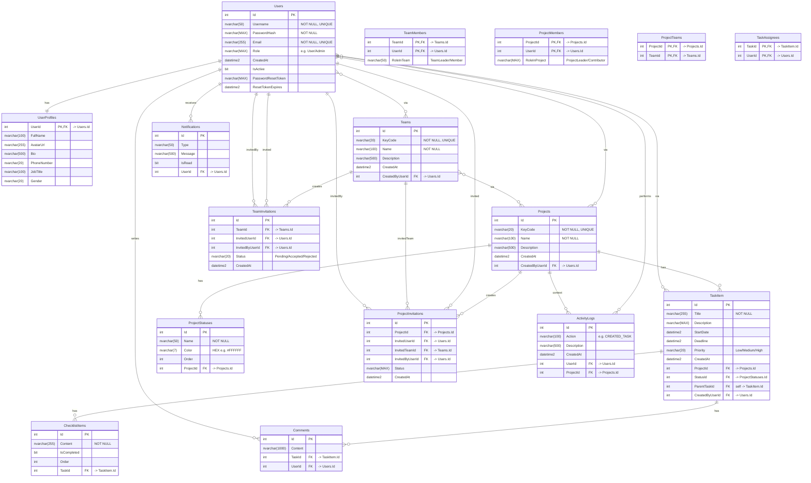

# 📌 Team Task Management System

Một hệ thống **back-end** toàn diện được xây dựng bằng **ASP.NET Core Web API** để quản lý công việc, dự án và nhóm.  
Hệ thống cung cấp bộ API mạnh mẽ để xử lý người dùng, xác thực, quản lý dự án, phân công công việc và cộng tác nhóm.

---

## ✨ Tính năng chính

### **1. Quản lý Xác thực & Người dùng**
- Đăng ký và đăng nhập an toàn với **JWT (JSON Web Tokens)**.
- Chức năng *Quên mật khẩu* và *Đặt lại mật khẩu*.
- Quản lý thông tin cá nhân (**User Profile**).

### **2. Quản lý Nhóm (Team)**
- Tạo, cập nhật, xóa nhóm.
- Mỗi nhóm có **KeyCode** duy nhất để mời vào dự án.
- Quản lý thành viên: thêm, xóa, phân quyền **Team Leader**.
- Hệ thống mời thành viên qua KeyCode hoặc username/email.

### **3. Quản lý Dự án (Project)**
- Tạo, cập nhật, xóa dự án.
- Thêm/xóa thành viên hoặc toàn bộ nhóm vào dự án.
- Người tạo dự án mặc định là **Project Leader**.
- Hệ thống mời linh hoạt: mời từng người hoặc cả nhóm.

### **4. Quản lý Công việc (Task)**
- Tạo, cập nhật, xóa công việc.
- Giao việc cho nhiều thành viên.
- Thuộc tính chi tiết: tiêu đề, mô tả, ngày bắt đầu, deadline, độ ưu tiên, trạng thái.
- Quản lý **Checklist** cho từng công việc.

### **5. Hệ thống Trạng thái Công việc (Status)**
- Quản lý các trạng thái (To Do, In Progress, Done) theo từng dự án.
- Tạo, sửa, xóa, sắp xếp lại các cột trạng thái.

---

## 🚀 Công nghệ sử dụng
- **Framework:** .NET 8.0  
- **API:** ASP.NET Core Web API  
- **Database:** Microsoft SQL Server  
- **ORM:** Entity Framework Core 8  
- **Authentication:** JWT Bearer Token  
- **API Documentation:** Swashbuckle (Swagger)  

---

## 🛠️ Cài đặt và Chạy dự án

### **Yêu cầu**
- .NET 8 SDK  
- Microsoft SQL Server  
- SSMS hoặc Azure Data Studio  

### **Các bước cài đặt**

1. **Clone repository**
   ```bash
   git clone https://github.com/NgPhatbeepppp/team-task-management-system.git
   cd team-task-management-system/TeamTaskManagementSystem
   ```

2. **Cấu hình Connection String**
   - Mở `appsettings.json`
   - Sửa giá trị:
     ```json
     "ConnectionStrings": {
       "DefaultConnection": "Server=TEN_SERVER_CUA_BAN;Database=TeamTaskDB;Trusted_Connection=True;TrustServerCertificate=True;"
     }
     ```

3. **Áp dụng Migrations**
   ```bash
   dotnet ef database update
   ```

4. **Chạy ứng dụng**
   ```bash
   dotnet run
   ```

5. **Truy cập API**
   - API: [http://localhost:5250](http://localhost:5250)  
   - Swagger UI: [http://localhost:5250/swagger](http://localhost:5250/swagger)  

---

## 📚 API Endpoints (Tiêu biểu)

| Method | Endpoint | Mô tả |
|--------|----------|-------|
| POST   | `/api/Auth/register` | Đăng ký người dùng mới |
| POST   | `/api/Auth/login` | Đăng nhập & nhận JWT token |
| GET    | `/api/UserProfile/me` | Lấy thông tin người dùng hiện tại |
| POST   | `/api/Team` | Tạo nhóm mới |
| GET    | `/api/Team/mine` | Lấy danh sách nhóm của tôi |
| POST   | `/api/team/{teamId}/invitations` | Mời thành viên vào nhóm |
| POST   | `/api/Project` | Tạo dự án mới |
| GET    | `/api/Project/mine` | Lấy danh sách dự án của tôi |
| POST   | `/api/projects/{projectId}/invitations/user` | Mời người dùng vào dự án |
| POST   | `/api/projects/{projectId}/invitations/team` | Mời nhóm vào dự án |
| POST   | `/api/Tasks` | Tạo công việc mới |
| GET    | `/api/Tasks/project/{projectId}` | Lấy danh sách công việc của dự án |
| GET    | `/api/Tasks/mine` | Lấy công việc của tôi |
| PUT    | `/api/Tasks/{id}` | Cập nhật công việc |
| GET    | `/api/projects/{projectId}/statuses` | Lấy các trạng thái của dự án |
| POST   | `/api/projects/{projectId}/statuses` | Tạo trạng thái mới |

> 📌 **Lưu ý:** Xem đầy đủ endpoints trong `/swagger`.

---

## 📈 Sơ đồ Cơ sở dữ liệu (Database Schema)


---

Tất cả quan hệ và ràng buộc được định nghĩa trong `AppDbContext.cs` để đảm bảo tính toàn vẹn dữ liệu.
